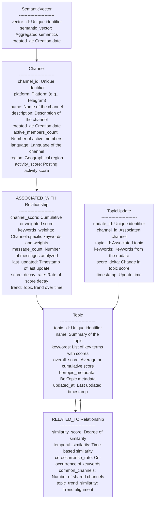

Here’s an updated markdown version with explanations for `SemanticVector` and `score_decay_rate`:

---

# Graph Representation

## Nodes

### Channel

- **channel_id**: Unique identifier
- **platform**: Platform (e.g., Telegram)
- **name**: Name of the channel
- **description**: Description of the channel
- **created_at**: Creation date
- **active_members_count**: Number of active members
- **language**: Language of the channel
- **region**: Geographical region
- **activity_score**: Posting activity score, indicating channel activity level

---

### Topic

- **topic_id**: Unique identifier
- **name**: Summary of the topic
- **keywords**: List of key terms with scores
- **overall_score**: Average or cumulative score
- **bertopic_metadata**: BerTopic metadata
- **updated_at**: Last updated timestamp

---

### TopicUpdate

- **update_id**: Unique identifier
- **channel_id**: Associated channel
- **topic_id**: Associated topic
- **keywords**: Keywords from the update
- **score_delta**: Change in topic score
- **timestamp**: Update time

---

### SemanticVector

- **vector_id**: Unique identifier
- **semantic_vector**: Aggregated representation of recent message semantics in a channel. This vector captures the
  summarized, anonymized essence of new content without storing individual messages, aligning with privacy requirements.
- **created_at**: Creation date

> **Explanation**: The `SemanticVector` represents the semantic profile of recent messages in a channel, allowing
> Concord to adjust topic relevance without storing each message. Each vector aggregates the semantics of recent content
> into a general representation, which can influence the `channel_score` in `ASSOCIATED_WITH` relationships between
> channels and topics. This approach maintains user privacy while updating topic relevance dynamically.

---

## Relationships

### ASSOCIATED_WITH (Channel → Topic)

- **channel_score**: Cumulative or weighted score representing a topic’s importance or relevance to the channel
- **keywords_weights**: Channel-specific keywords and their weights, reflecting the unique relationship between the
  channel and topic
- **message_count**: Number of messages analyzed in relation to the topic
- **last_updated**: Timestamp of the last update
- **score_decay_rate**: Rate at which `channel_score` decreases over time if no new relevant messages are analyzed. This
  decay rate allows topic scores to adjust gradually, so less active or outdated topics diminish in relevance without
  active content.
- **trend**: Indicator of topic trend over time within the channel

> **Explanation**: `score_decay_rate` ensures that topics associated with a channel decrease in relevance if no new
> messages support their ongoing importance. This helps maintain an accurate and current reflection of active discussions
> in a channel, giving more weight to trending or frequently discussed topics while allowing older or less relevant topics
> to fade naturally.

---

### RELATED_TO (Topic ↔ Topic)

- **similarity_score**: Degree of similarity between two topics
- **temporal_similarity**: Time-based similarity metric to track changing topic relationships over time
- **co-occurrence_rate**: Frequency with which two topics are discussed together across channels
- **common_channels**: Number of shared channels discussing both topics
- **topic_trend_similarity**: Similarity in trends or changes in relevance for each topic

---